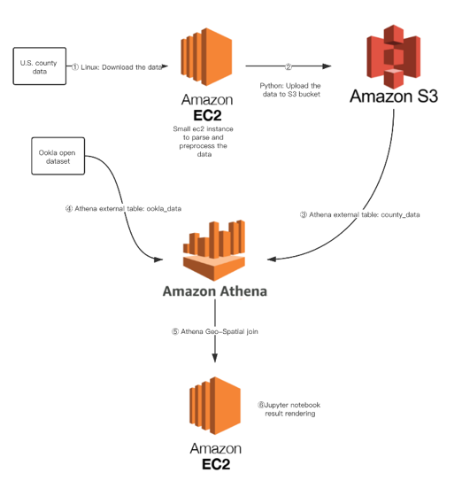

# U.S. internet speeds and readiness for hybrid work during and after Covid-19

## authors: Gelei  Chen, Nazmus Sakib, Qinghao Yang

## links to paper:

## System Layout

### Data pre-processing
* **conda_env.md** contains command to setup the conda enviroment.
* **county_data_main.py** is sued to convert county_data to parquet file format
* **zipcode_main.py** is used to convert zipcode_data to parquet file format

### Data Munipulation
* **speed_fixed_2020_q1.ipynb** is used to compute the final results for fixed(WIFI) 2020 Q1 results
* **speed_fixed_2021_q1.ipynb** is used to compute the final results for fixed(WIFI) 2021 Q1 results
* **speed_mobile_2020_q1.ipynb** is used to compute the final results for mobile 2020 Q1 results
* **speed_mobile_2021_q1.ipynb** is used to compute the final results for mobile 2021 Q1 results

### SCS Analysis 
* zipcodePriceSCSanalysis.csv